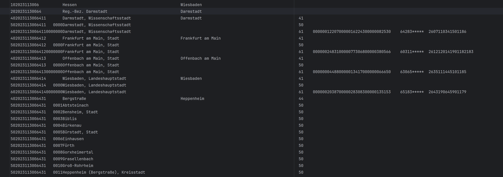
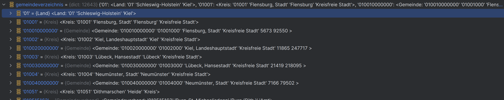

# python-gemeindeverzeichnis

Das statistische Bundesamt stellt eine Liste aller Gemeinden und übergeordneten Regionaleinheiten Deutschlands auf
seiner Webseite zur Verfügung. *python-gemeindeverzeichnis* ist eine Python-Bibliohek, welche die zur Verfügung
gestellte Datendatei ausliest, interpretiert und als einer Menge von Python-Objekten typisiert zur einfacheren
Verarbeitung zur Verfügung stellt.

> [!NOTE]
> Dieses Projekt wurde von https://github.com/podolsir/python-gemeindeverzeichnis geforkt. Der ursprüngliche Autor und wesentliche Urheber der Bibliothek ist **Igor Podolskiy**. Dieses Repository enthält lediglich einige kleine Anpassungen, die für meine Arbeit notwendig waren.  

## Datenbasis

Das statistische Bundesamt stellt die Datendatei zur regionalen Gliederung auf ihrer Webseite
unter `https://www.destatis.de/DE/Themen/Laender-Regionen/Regionales/Gemeindeverzeichnis/_inhalt.html#101366` zur
Verfügung. Die dort zur Verfügung gestellte Datei nennt sich *GV100AD* und wird als Textdatei in einem Format mit
fester Satzlänge zur Verfügung gestellt.

Jeder Satz dieser Datei enthält eine deutsche Regionaleinheit zusammen mit diversen Informationen, wie dem Regionalschlüssel und dem Namen der Regionaleinheit.
Für Regionaleinheiten wie Gemeinden stehen weitere statistische Informationen wie die Einwohnerzahl und die Fläche zur Verfügung.



Regionaleinheiten sind:
 - Bundesländer
 - Regierungsbezirke
 - Kreise (Kreisfreie Städte und Landkreise)
 - Gemeindeverbände
 - Gemeinden

[*] https://www.destatis.de/DE/Themen/Laender-Regionen/Regionales/Gemeindeverzeichnis/Glossar/regionaleinheiten.html

## Benutzung

Ein mitgelieferter Stand des Gemeindeverzeichnis (Stand: 30.11.2023) kann wie folgt abgerufen werden:

```python
from gemeindeverzeichnis.gemeindeverzeichnis import load_gemeindeverzeichnis

gemeindeverzeichnis = load_gemeindeverzeichnis()
```

Ansonsten muss der Pfad zur Datendatei über die weiteren Parameter mit angegeben werden:

```python
def load_gemeindeverzeichnis(filename: str | None=None, ignore_redundant_gemeindeverbaende=True):
    """
    Lädt das Gemeindeverzeichnis

    Args:
        filename: Dateiname der GV100AD-Datendatei, die für das Einlesen verwendet werden soll.
        ignore_redundant_gemeindeverbaende: Gibt an, ob Gemeindeverbände die selbst nur aus einer Gemeinde bestehen, ignoriert und damit herausgefiltert werden.

    Returns:
        Gibt ein Dictionary zurück, welches die Regionalschlüssel der Regionaleinheiten auf das gesamte Regionaleinheiten-Objekt
        RSObject abbildet.
        
        z.B.:
        {
            "01": Land(<Schleswig-Holstein>),
            "01001": Kreis(<Flensburg, Stadt>),
            "010010000000": Gemeinde(<Flensburg, Stadt>),
            ...
        }

    """
```

Zurückgegeben wird ein Dictionary, welches die Regionalschlüssel der Regionaleinheiten auf das gesamte Regionaleinheiten-Objekt
RSObject und entsprechende Subklassen (Land, Kreis, Gemeinde, Gemiendeverband, Regierungsbezirk, Region) abbildet.



### Regionaleinheiten

#### Gemeinde (60)
Folgende Daten stellt das Objekt *Gemeinde* zur Verfügung:

```python
    name: str

    typ: int
    typ_string: str

    bevoelkerung: int
    maennlich: int
    weiblich: int

    flaeche: int
    flaeche_in_km2: float

    finanzamtsbezirk: int | None
    oberlandesgerichtsbezirk: str
    landgerichtsbezirk: int | None
    amtsgerichtsbezirk: int | None
    arbeitsamtsbezirk: int | None

    plz: str
    plzeindeutig: bool

    bundestagswahlkreis: tuple[int | None, int | None]

    # from RSObject:
    #
    # rs: str
    # ags: str
    # gebietsstand: int
    # bundesland: Bundesland
    #
    # parent: RSObject | None
    # children: RSObject[]
```

Alle anderen Regionaleinheiten, also Land, Kreis, Gemeindeverband, Regierungsbezirk und Region sind 
den Gemeinden übergeordnet. In der originalen Datendatei enthalten diese selbst keine Informationen über
die Bevölkerungsgröße. Hier wird sie jedoch aus den Bevölkerungsgrößen der untergeordneten Gemeinden berechnet.

#### Land (10)

Folgende Daten stellt das Objekt *Land* zur Verfügung:

```python
name: str
sitz_landesregierung: str
level: int

# from DerivedBevoelkerungMixin:
#
# bevoelkerung: int
# maennlich: int
# weiblich: int
#

# from RSObject:
#
# rs: str
# ags: str
# gebietsstand: int
# bundesland: Bundesland
#
# parent: RSObject | None
# children: RSObject[]
```

#### Regierungsbezirk (20)

Folgende Daten stellt das Objekt *Regierungsbezirk* zur Verfügung:

```python
name: str
sitz_verwaltung: str
level: int

# from DerivedBevoelkerungMixin:
#
# bevoelkerung: int
# maennlich: int
# weiblich: int
#

# from RSObject:
#
# rs: str
# ags: str
# gebietsstand: int
# bundesland: Bundesland
#
# parent: RSObject | None
# children: RSObject[]
```

#### Region (30)
```python
name: str
sitz_verwaltung: str
level: int

# from DerivedBevoelkerungMixin:
#
# bevoelkerung: int
# maennlich: int
# weiblich: int
#

# from RSObject:
#
# rs: str
# ags: str
# gebietsstand: int
# bundesland: Bundesland
#
# parent: RSObject | None
# children: RSObject[]
```

#### Kreis (40)

Folgende Daten stellt das Objekt *Kreis* zur Verfügung:

```python
name: str
sitz_verwaltung: str
typ: int
typ_string: str
level: int

# from DerivedBevoelkerungMixin:
#
# bevoelkerung: int
# maennlich: int
# weiblich: int
#

# from RSObject:
#
# rs: str
# ags: str
# gebietsstand: int
# bundesland: Bundesland
#
# parent: RSObject | None
# children: RSObject[]
```


#### Gemeindeverband (50)

Folgende Daten stellt das Objekt *Gemeindeverband* zur Verfügung:
```python
name: str
sitz_verwaltung: str
typ: int
typ_string: str
level: int

# from DerivedBevoelkerungMixin:
#
# bevoelkerung: int
# maennlich: int
# weiblich: int
#

# from RSObject:
#
# rs: str
# ags: str
# gebietsstand: int
# bundesland: Bundesland
#
# parent: RSObject | None
# children: RSObject[]
```
